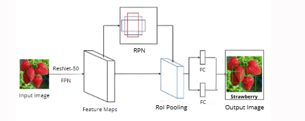

#  **FruitVision: AI-based Application for Counting and Classification** 

## **Table of Contents**
- [📌 Project Overview](#-project-overview)
- [🔑 Key Objectives](#key-objectives)
- [🚀 Technologies Used](#technologies-used)
- [🏛️ Architecture](#architecture)
- [📜 Data](#-data)
- [🧠 Model](#-model)
   - [Data Annotation: Transformation to COCO Format](#️-data-annotation-transformation-to-coco-format)
   - [Model Architecture](#️-model-architecture)
- [ 🔗 Model Integration](#-model-integration)   
- [Setup and Deployment](#setup-and-deployment)
- [Results](#results)
- [Challenges and Future Improvements](#challenges-and-future-improvements)

---

## 📌 Project Overview  

### 📚 Background:
This project, developed by Hiba Daoud and Farah Elloumi as part of their end-of-year work at the Higher School of Communications in Tunis (SUP'COM), aims to **count and classify fruits on trees** to assist farmers in **yield estimation** while maintaining a **detailed history** of the classified fruits for improved tracking and management.

### 🌟 Project Scope:

The project is divided into **two main parts**:
1. **Model Development**: Building a deep learning computer vision model for processing, detecting, classifying, and counting fruits on trees.
2. **Application Development**: Integrating the model into an application, with a backend and a persistent database for seamless functionality.


## 🔑 Key Objectives

- 🖼️ **User-Friendly Interface**  
   Develop an **intuitive and easy-to-use application** that allows farmers to:
   - Capture photos of their trees.  
   - View the processed results, including fruit detection, classification, and counts.  

- 🧠 **Deep Learning Integration**  
   Incorporate a **computer vision model** for:  
   - Image processing.  
   - Accurate detection, classification, and counting of fruits on trees.  

- 📊 **Data Persistence**  
   Implement a **MongoDB database** to:  
   - Store the history of fruit yield estimations.  
   - Enable efficient tracking and analysis for crop management.  

- 🔗 **Seamless Integration**  
   Ensure smooth and real-time integration between the following components:  
   - **Deep Learning Model**  
   - **Application Frontend** (for user interaction).  
   - **Backend Database** (for data storage and retrieval).  


## 🚀 Technologies Used

| Component            | Technology                          |
|-----------------------|-------------------------------------|
| **Model**            | Detectron2, Faster R-CNN |
| **Backend API**      | FastAPI                             |
| **Frontend**         | Flutter                             |
| **Backend**          | Express.js, MongoDB                |
| **Authentication**   | Firebase Auth                      |
| **Containerization** | Docker                              |

## 🏛️ Architecture


## 📜 Data:
- We collected **194 images** spanning 6 fruit categories: **Apples, Strawberries, Kiwis, Lemons, Oranges**, and an **Unknown** type.

- Each image was annotated using **LabelMe** to generate individual JSON files.  
   - These annotations include:
     - Bounding boxes.
     - Object categories.

- The images are in the dataset directory

## 🧠 Model:
The fruit detection model is built using **Faster R-CNN** with the [**Detectron2**](https://github.com/facebookresearch/detectron2) library.

### 🗂️ **Data Annotation: Transformation to COCO Format**

To facilitate the integration of annotated data with the model, we converted individual **LabelMe JSON files** into a single **COCO JSON file** useful for object detection and segmentation tasks.

#### **Process**   

1. **Transformation**:  
   - The **labelme2coco** tool was used to combine all LabelMe JSON files  into a single **COCO JSON file**.  

2. **COCO JSON Structure**:  
   The resulting COCO file contains:  
   - **Images**: The paths and metadata of all annotated images.  
   - **Annotations**: Bounding boxes, segmentation masks, and associated categories.  
   - **Categories**: Labels for the detected objects (e.g., Apples, Strawberries, etc.).

### 🧠 **Model Architecture**

We implemented the **Faster R-CNN** model with a **ResNet-50** backbone and **Feature Pyramid Network (FPN)** for fruit detection and classification.

#### **1. Feature Extraction and Multi-Scale Representation**
<div align="center">
    
</div>

- **Backbone - ResNet-50**  
   - Extracts essential features from the input images using convolutional layers.  
   - At each layer, the image resolution is divided by 2, allowing for a detailed analysis at multiple scales.  

-  **Feature Pyramid Network (FPN)**  
   - Enhances the feature maps generated by ResNet-50 by combining features at different resolutions.  
   - Produces **multi-scale feature maps** that allow the model to detect fruits of various sizes effectively.  

#### **2. Fruit Detection and Classification Process**
<div align="center">
    
</div>

1. **Region Proposal Network (RPN)**:  
   - The FPN-generated feature maps are used to propose potential regions (RoIs) where fruits might be located.  
   - Each proposal is assigned an **objectiveness score** to filter irrelevant regions.  

2. **RoI Pooling**:  
   - Valid regions are normalized and resized to a fixed size.  
   - This ensures consistent input for further processing.

3. **Classification and Refinement**:  
   - Fully connected layers analyze each **RoI** to:  
     - Determine the **class** of the detected object (e.g., Apple, Strawberry).  
     - Refine the **bounding box** around the fruit for precise localization.

4. **Final Output**:  
   - The model outputs an image annotated with **bounding boxes** around each detected fruit and its corresponding classification label.  
   - The total number of fruits is determined by counting the bounding boxes.


## 🔗 Model Integration 
The model is integrated into the application via **FastAPI**:
- **Model Inference**: FastAPI serves as the backend API to perform predictions.
- **Endpoints**:
   - **/analyze**: Accepts input images for fruit detection.
   - **/get_analyzed_image**: Retrieves processed images with bounding boxes.
- **Data Flow**:
   - **Frontend**: Flutter app sends images to FastAPI.
   - **Backend**: FastAPI processes the image using the trained model and returns results.
   - **History Storage**: Results are stored in **MongoDB**.

---

## **Setup and Deployment**

### Prerequisites
- Docker
- Kubernetes CLI (`kubectl`)
- Azure Kubernetes Service (AKS) cluster set up
- GitLab CI with environment variables:
   - MongoDB credentials
   - Firebase service account

### Steps to Deploy
1. **Clone the repository**:
   ```bash
   git clone <repo-link>
   cd project-directory
